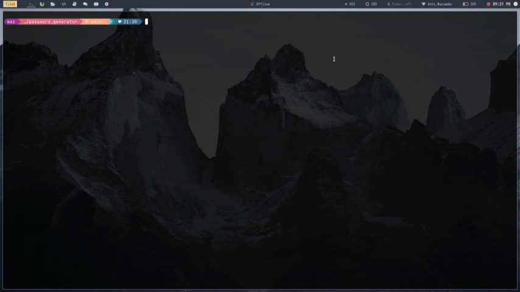
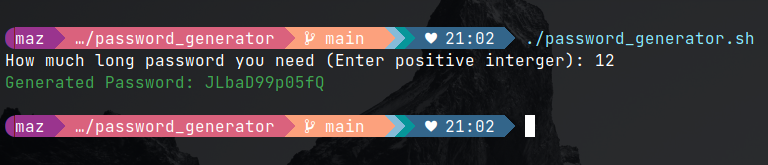

# Password Generator

This Bash script generates a random alphanumeric password of a specified length.



## Usage

1. Make the script executable:
    ```bash
    chmod +x password_generator.sh
    ```

2. Run the script:
    ```bash
    ./password_generator.sh
    ```

3. Enter the desired length for the password when prompted.

## Example



## Notes

- This script uses `/dev/urandom` to generate random characters.
- Ensure that the entered length is a valid number.
- The generated passwords are alphanumeric (letters A-Z, a-z, and digits 0-9).

## Contribution

Feel free to contribute to improve this script by creating pull requests or reporting issues.
